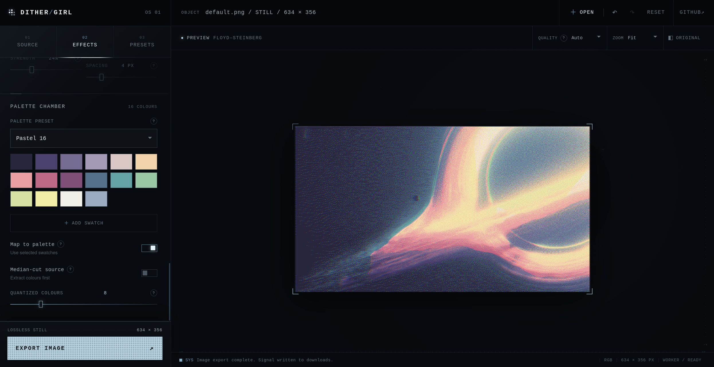
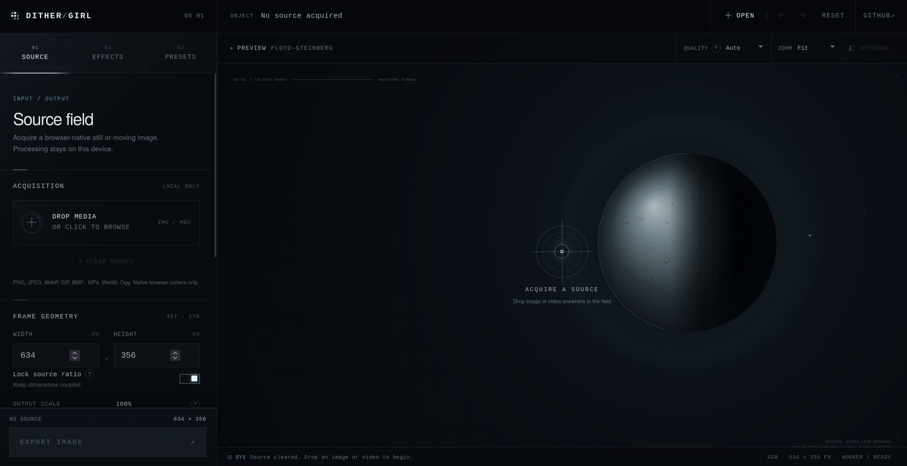
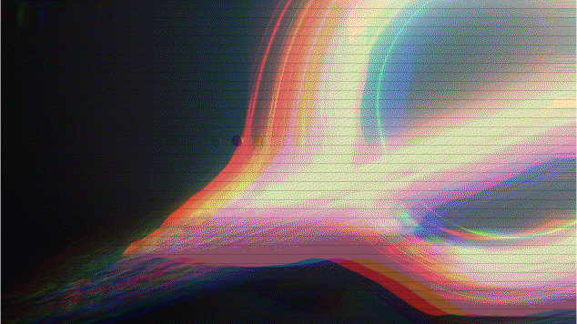
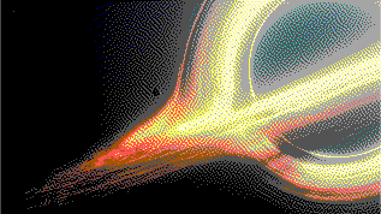
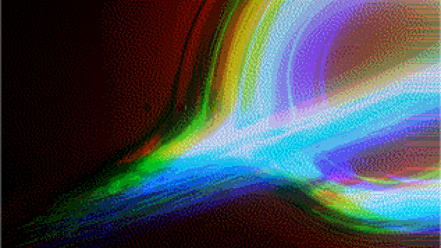
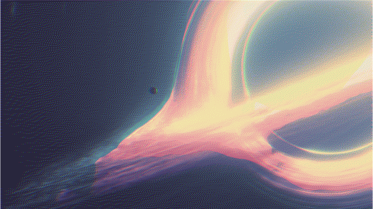
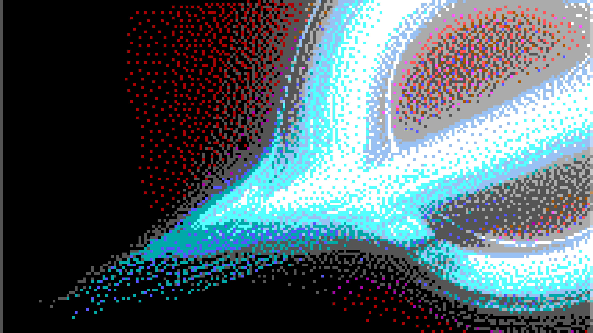

<h1 align="center">Dither Girl</h1>

<p align="center">
  A private, browser-based image and video dithering studio with an atmospheric orbital interface.
</p>

<p align="center">
  
  
  
  
</p>

<p align="center">
  
</p>

Dither Girl is a static, client-side creative tool for dithering, colour reduction, toning, and signal-style effects. Images and videos are decoded and processed locally with Canvas, ES modules, and a Web Worker. There is no backend, account, upload service, build command, or server-side media processing.

## Features

- Drag-and-drop image and browser-native video input
- Live, worker-backed preview with queued, processing, ready, and error states
- Error-diffusion, ordered, halftone, noise, and threshold dithering
- Editable palettes, median-cut colour extraction, and palette mapping
- Grayscale, duotone, tritone, levels, gamma, posterize, hue, saturation, grain, and inversion controls
- Experimental chromatic drift and scanline effects
- Non-destructive effect-family bypass switches and an effects-only reset
- Delayed help hints for advanced controls
- User presets stored locally across refreshes and browser sessions
- Independent output resolution, scale, fit, resampling, and dither-pixel-size controls
- PNG, JPEG, WebP, and browser-supported video export
- Responsive interface with no framework or build tooling

## Interface

The editor opens into a lightweight procedural space scene and recedes once media is loaded, keeping the processed image or video as the visual focus.

<p align="center">
  
</p>

## Output examples

The examples below use the same source to show how different palettes, algorithms, and effect combinations can produce distinctly different results.

<table>
  <tr>
    <td width="50%" align="center">
      <br>
      <sub>Original source</sub>
    </td>
    <td width="50%" align="center">
      <br>
      <sub>Chromatic signal treatment</sub>
    </td>
  </tr>
  <tr>
    <td width="50%" align="center">
      <br>
      <sub>Reduced palette diffusion</sub>
    </td>
    <td width="50%" align="center">
      <br>
      <sub>Spectral gradient treatment</sub>
    </td>
  </tr>
  <tr>
    <td width="50%" align="center">
      <br>
      <sub>Pastel palette treatment</sub>
    </td>
    <td width="50%" align="center">
      <br>
      <sub>Low pixel density treatment</sub>
    </td>
  </tr>
</table>

## Dithering algorithms

### Error diffusion

- Floyd–Steinberg
- False Floyd–Steinberg
- Jarvis–Judice–Ninke
- Stucki
- Atkinson
- Burkes
- Sierra-3, Two-Row Sierra, and Sierra Lite
- Steven Pigeon

### Ordered and alternative methods

- Bayer 2×2, 4×4, 8×8, and 16×16
- Clustered-dot halftone
- CMYK angled halftone
- Blue noise and white noise
- Simple threshold

## Running

Visit the [website](https://dithergirl.ai9an.com) and experiment with the tool (recommended)

Alternatively if you wanted to run this tool locally follow the guide below

## Local install

No dependencies need to be installed. Clone or download the repository, then serve its directory with any static file server:

```bash
git clone https://github.com/ai9an/dither-girl.git
cd ditherGirl
python3 -m http.server 8000
```

Open [http://localhost:8000](http://localhost:8000) in your browser.

On Windows, use `py -m http.server 8000` if `python3` is unavailable. Opening `index.html` directly also works in permissive browsers, but a local server is recommended because some browsers restrict ES modules or module workers on `file://` URLs.

## Media support

| Type | Input | Export |
| --- | --- | --- |
| Images | PNG, JPEG, WebP, GIF static frame, BMP, and other formats decoded natively by the browser | PNG, JPEG, WebP |
| Video | MP4/H.264, WebM, and Ogg when supported by the browser | The best container and codec exposed by `MediaRecorder` |

Video export uses `canvas.captureStream()` and includes the source audio track when the browser exposes one. Format and codec support vary by browser; the application reports the selected recording format in the Source panel.

## Privacy and local storage

Media never leaves the browser. Processing, previews, and exports happen on the user's device without external API calls.

Saved user presets use browser-local storage. They persist across refreshes and later visits for the same site address, but they are not synchronized between browsers, devices, local development, and the deployed GitHub Pages URL.

## Acknowledgements

Inspired by [Liyieon/Dither_Tone.exe](https://github.com/Liyieon/Dither_Tone.exe), expanded with additional algorithms, colour tools, video support, presets, and an original browser interface.

Built with [codex-cli](https://github.com/openai/codex) using 5.6sol-high
